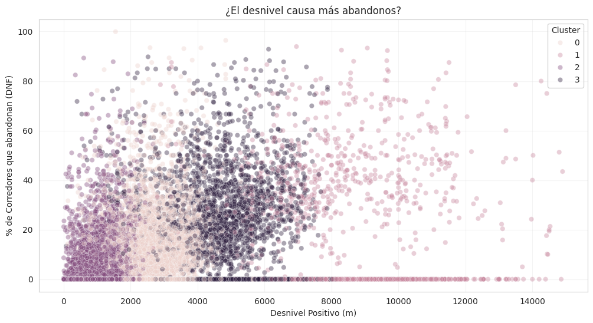

# Analyse de la Résilience et de la Performance : Le Trail Running en France
*Projet de Data Science - Analyse de 38 000 courses (Données UTMB World Series)*

## 📌 Présentation du Projet
Ce projet explore les facteurs qui influencent l'abandon (DNF) et la performance des coureurs de trail sur le territoire français. L'objectif est de comprendre si des variables comme le genre, la nationalité ou la géographie impactent la réussite d'une épreuve.

## 📊 Insights Clés
* **Démystification du Genre & Nationalité :** Ni le genre (-0.01) ni l'origine (-0.09) ne sont des prédicteurs d'abandon.
* **La "Zone Critique" :** Les plus hauts taux d'abandon se trouvent sur des courses à dénivelé moyen (2000m - 6000m).
* **Le Coût de l'Ascension :** Chaque 100m de dénivelé positif ajoute environ 5,4 minutes au temps du vainqueur.

## 📈 Visualisations
 

## 🛠️ Stack Technique
Python (Pandas, Scikit-Learn, Seaborn, Folium).
