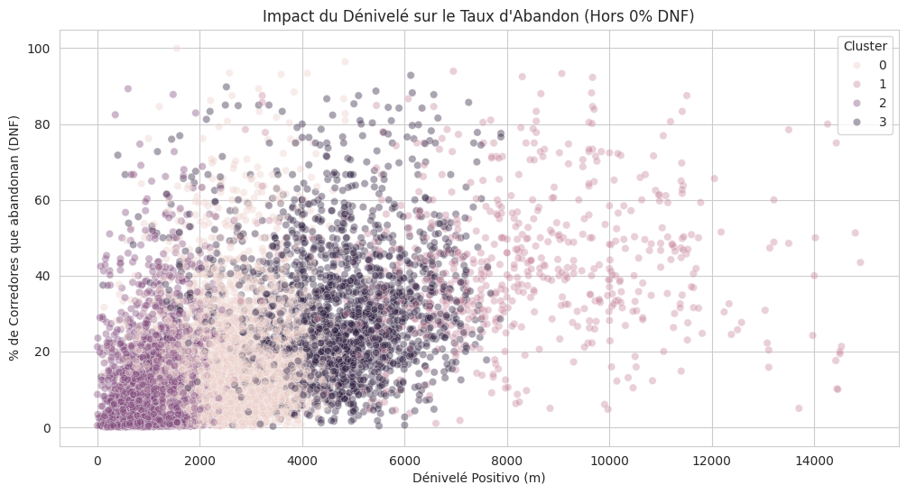

# Analyse de la Résilience et de la Performance : Le Trail Running en France
*Projet de Data Science - Analyse de 38 000 courses (Données UTMB World Series)*

## 📌 Présentation du Projet
Ce projet explore les facteurs qui influencent l'abandon (DNF) et la performance des coureurs de trail sur le territoire français. L'objectif est de comprendre si des variables comme le genre, la nationalité ou la géographie impactent la réussite d'une épreuve.

## 📊 Insights Clés
* **Démystification du Genre & Nationalité :** Ni le genre (-0.01) ni l'origine (-0.09) ne sont des prédicteurs d'abandon. Le trail est une discipline purement basée sur la préparation individuelle.
* **Le Paradoxe du DNF :** Les plus hauts taux d'abandon ne sont pas sur les courses extrêmes, mais sur les épreuves à dénivelé moyen (2000m - 6000m), souvent dû à une gestion d'allure trop agressive.
* **Le Coût de l'Ascension :** Chaque 100m de dénivelé positif ajoute environ 5,4 minutes au temps du vainqueur.

## 🤖 Modélisation Prédictive (Machine Learning)
J'ai développé un modèle de **Régression Linéaire** pour estimer le temps de course en fonction des caractéristiques physiques du terrain :

* **Précision (Score R²) : 0.86** – Le modèle explique 86% de la variabilité du temps final, démontrant une fiabilité élevée.
* **Erreur Moyenne (MAE) : 80 min** – Une marge d'erreur optimisée pour des épreuves de longue durée, expliquée par des facteurs externes (météo, technicité du sentier).
* **Segmentation :** Utilisation de l'algorithme **K-Means** pour catégoriser les 38 000 courses en 4 clusters d'effort (de "Nature" à "Ultra Alpin").

## 📈 Visualisations
 

## 🛠️ Stack Technique
* **Langages :** Python
* **Data Science :** Pandas, NumPy, Scikit-Learn (K-Means, Linear Regression)
* **Visualisation :** Matplotlib, Seaborn, Folium (Cartographie)
